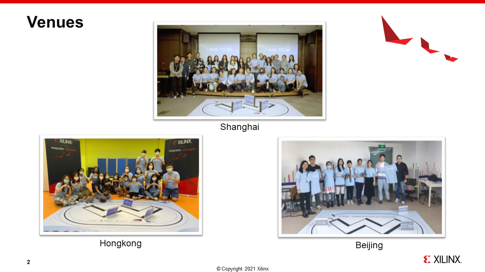
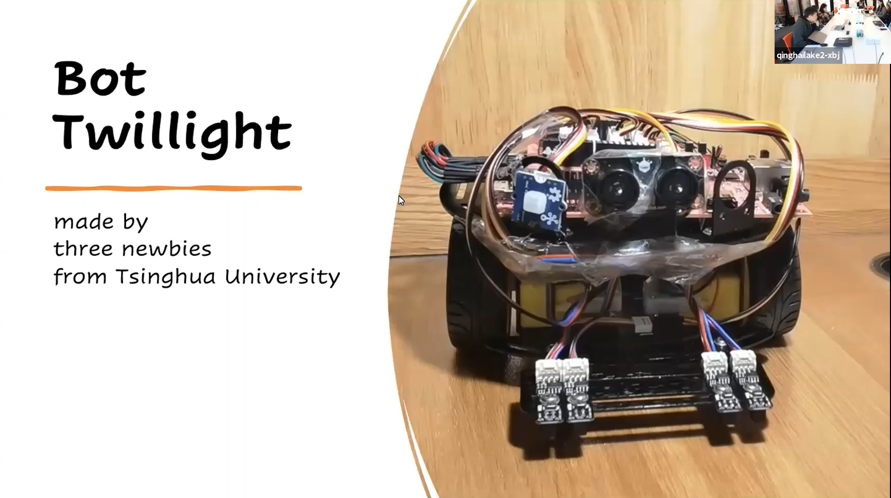

# 2021-Women_In_Tech_Hackthon
This repository contains the final presentation of the 2021 women in tech hackthon.

The events have 3 days

Day1: Training and Learning

Day2：Racing on given map

Day3：Propsal and implement the creative idea

You can find the summary video here [Video](https://youtu.be/HorqFNmhYJc)

## Holding Venus of Oct. 17th Racing Day

## Participants and Ranking

The Chart below demonstrates the **ranking of the racing day**

HKUSTeam held the fastest record of 2021, click the link below to view their performance

[HKUSTeam Racing](https://youtu.be/6zkFTHvw0rw)

## Presentations and Awards

The final grade contains two parts, 50% of the racing performance of the racing day and the other 50% of the final Presentation. According to the grading rule, the final awards come as following:

### Best Innovation Award: 
711 from ShanghaiTech University [Video](https://youtu.be/HorqFNmhYJc)

### Best Performance Award: 

HKUSTeam from Hong Kong University of Science and Technology [Video](https://youtu.be/l6C9estO0_8) 

### Other great presentations
The New Team from Parson's School of Design [Video](https://youtu.be/VRr0CNRPhaw)

THU team from Tsinghua University [Video](https://youtu.be/kdRjoUWxcL4)

CityU Team from City University of Hong Kong [Video](https://youtu.be/NWYWV4WW_nM)

